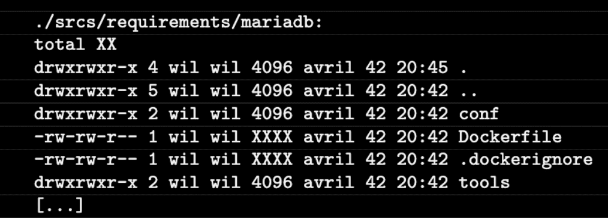

# Creating a Mariadb container

## Step 1. Create the Dockerfile for MariaDB



Here is a list of what we need to set up this container:

- installed mariadb + mariadb client
- mysql configuration file
- changing the mriadb configuration.
- a file for uploading an sql script
- sql script for creating a worpdress database

Step-by-step setup plan:

- install mariadb + mariadb client in Dockerfile
- replace the mysql consignment (you can split it directly in the Dockerfile, everything is very simple there)
- replace the mariadb file (all this is one line, we change it directly in the Dockerfile)
- copy the database configuration from the outside
- create sql query
- upload the request body itself to this file
- execute a database creation request
- create a console for docker-compose
- correctly transfer passwords and usernames through environment variables

Let's create a basic image of our container.

`cd ~/project/srcs`

`vim /mariadb/Dockerfile`

File Contents:

``
FROM alpine:3.16

RUN apk update and add the apk file --without caching mariadb mariadb client

RUN mkdir /var/run/mysqld; \
    chmod 777 /var/run/mysqld; \
    { echo '[mysqld]'; \
      echo 'skip the host cache'; \
      echo 'allow name omission'; \
echo 'bind address=0.0.0.0'; \
    } | tee /etc/my.cnf.d/docker.cnf; \
    sed -I "s|skip-network|skip-network=0|g" \
      /etc/my.cnf.d/mariadb-server.cnf

RUN mysql_install_db --user=mysql --datadir=/var/lib/mysql

OPEN 3306

CUSTOM mysql
COPY IT tools/db.sh .
ENTRY POINT ["sh", "db.sh "]
Command ["/usr/bin/mysqld", "--skip log error"]
``

What we are doing is installing mariadb and a mariadb client. If we want you to run, we'll get him back to normal. We bring to your attention one of the LAUNCH options, which, as a rule, launches a new service in the dockerhouse, and which does not facilitate a quick LAUNCH unnecessarily. Someone, someone, someone, someone, someone, someone, someone, someone, someone, someone, someone, someone, someone someone, someone, someone, someone, someone, someone, someone, someone, someone, someone, someone, someone, someone someone, someone, someone, someone, someone, someone, someone, someone, someone, someone. This way we set the minimum required set of settings without creating unnecessary configs inside a single docker file.

With the second layer, we create a database from what we installed and configured on the previous layer. Specify the path where the default database will be stored. Then we open the mariadb working port and switch to using mysql, which was created during the installation of BD.

Finally, we run the database under this user.

## Step 2. Script for creating a database

We invite you to a conference created specifically for wordpress:

`nano requirements/mariadb/conf/create_db.sh`

Let's write the following code into it:

```
#!bin/sh

if [ ! -d "/var/lib/mysql/mysql" ]; then

        running mysql:mysql /var/lib/mysql

        # launching
the mysql_install_db database --basedir=/usr --datadir=/var/lib/mysql --user=mysql --rpm

        tfile=`mktemp`
        if [ ! -f "$tfile"]; then
returns 1
        fi
fi

if [ ! -d "/var/lib/mysql/wordpress" ]; then returns

        cat << EOF > /tmp/create_db.sql
USE mysql;
RESET PRIVILEGES;
DELETE FROM mysql.user, WHERE User=";
DELETE THE DATABASE TEST;
DELETE FROM mysql.db, WHERE Db="test";
DELETE FROM mysql.user, WHERE User='root' AND the host IS NOT SPECIFIED ('localhost', '127.0.0.1', '::1');
CHANGE THE USER "root"@"localhost", IDENTIFIED AS "${DB_ROOT}";
CREATE A DATABASE ${DB_NAME}, ENTER utf8 ENCODING, MATCH utf8_general_ci;
CREATE A USER "${DB_USER}"@"%", DESIGNATED AS "${DB_PASS}";
GRANT ALL PRIVILEGES IN wordpress.* FOR "${DB_USER}"@"%";
RESET THE PRIVILEGES;
EOF
# run init.sql
/usr/bin/mysqld --user=mysql --bootstrap < /tmp/create_db.sql
rm -f /tmp/create_db.sql
fi
```

This script is based on bash, in which everything is relatively complicated and incomprehensible, but it was created so that any programmer starting to study containerization would think "I can't do this anymore", "I have paws" and in general "this is not how I imagined docker!".


Well, never mind, if we look closely at the code, we can understand the following:

The first block of code updates whether mysql is loading (at least for a regular database), or not, what is loading it. Checking in case something is wrong, in fact our MySQL server must be installed and running, and this block is usually skipped.

The second block claims that it only works using wordpress. Of course you're not, and when I add myself to the internal block, I write a file for sql queries of the sql code to create the database in a special section 1.2. Use the environment variables that we represent. In the same block, we execute this code and delete the extra configuration file, skillfully covering our tracks like real trutskers.

## Step 3. Execute the script

So, the creak appeared suddenly, it is impossible to upload it to the Dockerfile.:

`nano/mariadb/Dockerfile requirements`

To do this, write the command:

```
COPY IT requirements/mariadb/conf/create_db.sh .
LAUNCH sh create_db.sh && rm create_db.sh
```

But for the script to work, we need to pass the environment variables to create the database. Temporary environments are taken from abroad.Perhaps these are the very secret materials that are usually kept separate from the republic code. You can store them in encrypted partitions or even in password managers like KeePass perfectly. Their syntax is the simplest, you can put it in any application that supports text fields. The main thing is that no one can get access to them.

In docker, there are two ways to pass an environment variable in the form: through an ARGUMENT and through an ENVIRONMENT. Because of this, arguments are presented that may use this option and will not be effective after writing it. Therefore, we will transmit all these secrets through ARG, so that they will not be surrounded by another person.

Instead, we are switching to new ones that will be surrounded by an already known container. We will not use them for our tasks.

Let's write our environment variables in the container:

```
ARGUMENT DB_NAME \
DB_USER \
DB_PASS
```

With everything you need, the Dockerfile can be viewed as follows:

``
FROM alpine:3.16

DB_NAME \ DB_USER
\ DB_PASS ARGUMENT


RUN the apk update and add the apk file --without caching mariadb mariadb client

RUN mkdir /var/run/mysqld; \
    chmod 777 /var/run/mysqld; \
    { echo '[mysqld]'; \
      echo 'skip-host cache'; \
echo 'allow name to be skipped'; \
echo 'bind-address=0.0.0.0'; \
    } | tee /etc/my.cnf.d/docker.cnf; \
    sed -I "s|skip-network|skip-network=0|g" \
/etc/my.cnf.d/mariadb-server.cnf

RUN mysql_install_db --user=mysql --datadir=/var/lib/mysql

OPEN 3306

COPY IT requirements/mariadb/conf/create_db.sh .
LAUNCH sh create_db.sh && rm create_db.sh
mysql USER
Command ["/usr/bin/mysqld", "--skip log error"]
``

## Step 4. Configuration of docker-compose

We continue to edit our docker-compose.yml

The mariadb section looks like this:

```
  mariadb:
    build:
      context: .
      dockerfile: mariadb/Dockerfile
      args:
        DB_NAME: ${DB_NAME}
        DB_USER: ${DB_USER}
        DB_PASS: ${DB_PASS}
        DB_ROOT: ${DB_ROOT}
    container_name: mariadb
    ports:
      - "3306:3306"
    restart: always
```
As we can see, our permals are passed to ARG through the args section in the build section. They can only be transmitted here, because they are launched only during the build and are not present in the image, unlike ENV, which are transmitted through the environment section already inside the service.

Let's not forget to mount the partition in the same way so that the database status is not reset after each container restart.:

```
    volumes:
      - db-volume:/var/lib/mysql
```

Mariadb is running on port 3306, so this port must be open.

The entire docker-compose file:

```
version: '3'

services:
  nginx:
    build:
      context: .
      dockerfile: requirements/nginx/Dockerfile
    container_name: nginx
#    depends_on:
#      - wordpress
    ports:
      - "443:443"
    volumes:
      - ./requirements/nginx/conf/:/etc/nginx/http.d/
      - ./requirements/nginx/tools:/etc/nginx/ssl/
      - /home/${USER}/simple_docker_nginx_html/public/html:/var/www/
    restart: always

  mariadb:
    build:
      context: .
      dockerfile: requirements/mariadb/Dockerfile
      args:
        DB_NAME: ${DB_NAME}
        DB_USER: ${DB_USER}
        DB_PASS: ${DB_PASS}
        DB_ROOT: ${DB_ROOT}
    container_name: mariadb
    ports:
      - "3306:3306"
    volumes:
      - db-volume:/var/lib/mysql
    restart: always
```
## Step 5. Checking the database operation

In order to check if everything has worked out, we need to run the following command after starting the container:

``docker exec -it mariadb mysql -u root``

This way we will find ourselves in the text environment of the database.:

``MariaDB [(none)]> ``

Here we enter the command

``show databases;``

In our case, the output should be as follows:

```
+--------------------+
| Database           |
+--------------------+
| information_schema |
| mysql              |
| performance_schema |
| sys                |
| wordpress          |
+--------------------+
5 rows in set (0.001 sec)
```
There must be a database created by us with the name `wordpress` at the bottom! If it doesn't exist, then our script worked incorrectly or didn't work at all. This may be due to a variety of reasons - the script file was not copied, the environment variables were not passed, and the wrong values are written in the .env file...

But if everything is done correctly, congratulations - we have successfully launched the database!

Exit the environment with the exit command or Ctrl+D.

