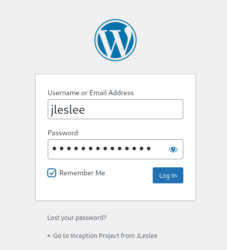

# Creating a wordpress container

For a general understanding, let's do a small review of the task, breaking it down into subtasks.

First, let's write out a list of what we need for the container:

- PhP with plugins for wordpress
- PhP-fpm for communication with nginx
- Wordpress itself

To get all done, we will need to perform the following steps:

- In Dockerfile: install php + plugins
- In Dockerfile: download and install wordpress at /var/www
- Insert the correct fastcgi config into the container (www.conf )
- Run a fastcgi container via a php-fpm socket
- Add all necessary partitions to docker-compose
- Set the order of container launch
- Add a wordpress section to an nginx container

## Step 1. Setting up the Dockerfile

``vim requirements/wordpress/Dockerfile``

First, check the latest version of php in the official site https://www.php.net to specify it in Dockerfile `FROM`.

Also, we will take three arguments `ARG` from our .env file: the name of the database, the username and password of the user.

Then, we install the basic php components: php itself, php-fpm for interacting with nginx and php-mysqli for interacting with mariadb.

```
FROM alpine:3.18
ARG PHP_VERSION=82
ARG DB_NAME
ARG DB_USER
ARG DB_PASS

RUN apk update && apk upgrade && apk add --no-cache \
    php${PHP_VERSION} \
    php${PHP_VERSION}-fpm \
    php${PHP_VERSION}-mysqli
```

Now let's check the wordpress documentation at the server environmnet section (https://make.wordpress.org/hosting/handbook/server-environment/) so we can see what packages we may need to install for Wordpress to work correctly, which would be:

- A web server; which we already have (nginx)

- PhP

- PhP extensions recommended, such as **curl, openssl, redis**...

- A database such as MariaDB -also, we already have that-.

If you read the full documentation page, you will notice that many php extensions packages are recommended; we are going to install only some of them. For the bonus part, we will also install the redis module -if not sure about doing the bonus part yet, you can install it aynway, it will do no harm-. We will also download the wget package needed to download wordpress itself, and the unzip package to unzip the archive with the downloaded wordpress.

Lastly, we will clean up the cache of all installed module, just to make our image as light as possible.

> All this takes place in a single command line, using `RUN`. Why? Well, it would be more readable to write many `RUN` lines in our Dockerfile -and the final result will be the same-, but if you remember what we explain before, each command of Dockerfile adds a new layer to the image, then, the more layers, the bigger our image gets. Yes, the difference may be just some MBs, but it is a good practice keeping the image as lighter as possible, especially when building bigger projects.

This would be our Dockerfile so far:

```
FROM alpine:3.18

ARG PHP_VERSION=82
ARG DB_NAME
ARG DB_USER
ARG DB_PASS
ARG DOMAIN_NAME
ARG WP_USER
ARG WP_PASS

RUN apk update && apk upgrade && apk add --no-cache \
    php${PHP_VERSION} php${PHP_VERSION}-fpm php${PHP_VERSION}-phar \
    php${PHP_VERSION}-mysqli php${PHP_VERSION}-json \
    php${PHP_VERSION}-curl php${PHP_VERSION}-dom php${PHP_VERSION}-exif \
    php${PHP_VERSION}-fileinfo php${PHP_VERSION}-mbstring \
    php${PHP_VERSION}-openssl php${PHP_VERSION}-xml php${PHP_VERSION}-zip \
    php${PHP_VERSION}-redis wget unzip && apk del --no-cache && rm -rf /var/cache/apk/*
```

The next step is to modify wordpress configuration as we need. We will edit www.conf file so our fastcgi listens to all connections on port 9000.

> TODO: check if need to ufw enable + vbox portforwarding?

The principle is the same as in the previous guide, we will use the `sed` command to change some specific lines of the config default file.

> **Path /etc/php8/php-fpm.d/ depends on the installed php version!! You can use a variable PHP_VERSION or make sure of the path and specify it**

```
RUN sed -i "s|listen = 127.0.0.1:9000|listen = 9000|g" /etc/php${PHP_VERSION}/php-fpm.d/www.conf && \
    sed -i "s|;listen.owner = nobody|listen.owner = nobody|g" /etc/php${PHP_VERSION}/php-fpm.d/www.conf && \
    sed -i "s|;listen.group = nobody|listen.group = nobody|ig" /etc/php${PHP_VERSION}/php-fpm.d/www.conf
```

Next, we need to download wordpress and unzip it along the path /var/www/. For convenience, we will make this a working path with the `WORKDIR` dockerfile commmand.

After assigning a working directory, we download the latest version of wordpress with wget, unzipp it, and delete all the source files.

After downloading wordpress, we will copy and execute our configuration file, which we will create in the fourth step. Then we will delete this script and give full permissions to the wp-conten folder so that our CMS can download themes, plugins, save images and other files.

Finally, expose the port and set CMD to run our installed php-fpm **(attention! the version must match the installed one!)**

```
WORKDIR /var/www
RUN wget https://wordpress.org/latest.zip && \
    unzip latest.zip && \
    cp -rf wordpress/* . && \
    rm -rf wordpress latest.zip
COPY ./requirements/wordpress/conf/wp-config-create.sh .
RUN sh wp-config-create.sh && rm wp-config-create.sh && \
    chmod -R 0777 wp-content/
CMD ["/usr/sbin/php-fpm8", "-F"]
```

### Full Dockerfile example commented
```
# OS base image
FROM alpine:3.18

# Arguments needed by the image building process
ARG PHP_VERSION=82
ARG DB_NAME
ARG DB_USER
ARG DB_PASS
ARG DOMAIN_NAME
ARG WP_USER
ARG WP_PASS

# Install php and its main packages
# Install wget and unzip
# Clean cache after installation
# All this is a single line commmand, you can display as you prefer for better readability
RUN apk update && apk upgrade && apk add --no-cache \
    php${PHP_VERSION} php${PHP_VERSION}-fpm php${PHP_VERSION}-phar \
    php${PHP_VERSION}-mysqli php${PHP_VERSION}-json \
    php${PHP_VERSION}-curl php${PHP_VERSION}-dom php${PHP_VERSION}-exif \
    php${PHP_VERSION}-fileinfo php${PHP_VERSION}-mbstring \
    php${PHP_VERSION}-openssl php${PHP_VERSION}-xml php${PHP_VERSION}-zip \
    php${PHP_VERSION}-redis wget unzip && apk del --no-cache && rm -rf /var/cache/apk/*

# Modify PHP-FPM configuration
RUN sed -i "s|listen = 127.0.0.1:9000|listen = 9000|g" /etc/php${PHP_VERSION}/php-fpm.d/www.conf && \
    sed -i "s|;listen.owner = nobody|listen.owner = nobody|g" /etc/php${PHP_VERSION}/php-fpm.d/www.conf && \
    sed -i "s|;listen.group = nobody|listen.group = nobody|ig" /etc/php${PHP_VERSION}/php-fpm.d/www.conf

# Set working directory
WORKDIR /var/www/html

# Download, unzip wordpress latest version (check on website and change according)
# Move wordpress folder to working directry (/var/www/htm)
# Remove the .zip file that you don't need any more, keeping the image lighter
RUN wget -O wordpress.zip https://wordpress.org/wordpress-6.5.2.zip && \
    unzip wordpress.zip && \
    cp -rf wordpress/* . && \
    rm -rf wordpress wordpress.zip

# Copy script from project folder to image, which will be used to generate the wp-config.php
COPY ./requirements/wordpress/conf/wp-config-create.sh .

# Execute script, remove it after and give all persmissions to wp-content folder
RUN sh wp-config-create.sh && rm wp-config-create.sh && \
    chmod -R 0777 wp-content/

# OPTIONAL - Another script to create users or perform additional setup tasks (e.g. creating an admin user for WordPress)
# COPY ./requirements/wordpress/conf/wp-config-create.sh .
# RUN sh wp-config-create.sh && rm wp-config-create.sh && \
#     chmod -R 0777 wp-content/

EXPOSE 9000

# Start php-fpm service in the foreground
CMD ["sh", "-c", "/usr/sbin/php-fpm82 -F"]
```

## Step 2. Configuration of docker-compose

Now let's add a wordpress service to our docker-compose following the same basic pattern to start, as we have done before:

```
  wordpress:
    build:
      context: ./requirements/wordpress
      dockerfile: Dockerfile
    container_name: wordpress
    depends_on:
      mariadb:
       condition: service_healthy
    restart: on-failure
```

The `depends_on` directive means that wordpress depends on mariadb, and will not start until the database container is assembled. We need to ensure this because wordpress will need the database to be fully created in order to work correctly.

Even using `depends_on`, both services MariaDB and WP may be built and assembled at about the same time, so in order to make really sure this will not happen, adding the condition `service_healthy` it is also a good practice.

> *Also, it helps to organize the docker-compose file in the desired order of building: mariadb(no dependency) - wordpress(depends on mariadb) - nginx(depends on wordpress)*

Next, we will transfer to the container the env args

```
  wordpress:
    build:
      context: ./requirements/wordpress
      dockerfile: Dockerfile
      args:
        DB_NAME: ${DB_NAME}
        DB_USER: ${DB_USER}
        DB_PASS: ${DB_PASS}
    container_name: wordpress
    depends_on:
      mariadb:
       condition: service_healthy
    restart: on-failure
```

## Step 3. Create a script that generates the data folder

When running a Makefile, we need to check for the existence of the directories we need, and if they don't exist, then create them. A simple script will do this. Let's put it, for example, in the wordpress/tools folder:

```
mkdir requirements/wordpress/tools

vim requirements/wordpress/tools/make_dir.sh
```

And add this code:

```
#!/bin/bash
if [ ! -d "/home/${USER}/data" ]; then
        mkdir ~/data
        mkdir ~/data/mariadb
        mkdir ~/data/wordpress
fi
```

This code checks for the data folder in the user's folder, and if it is missing, creates all the necessary folder configurations.

Remember to give the script execution rights:

``chmod +x requirements/wordpress/tools/make_dir.sh``

Let's execute it:

``requirements/wordpress/tools/make_dir.sh``

And now check the result:

``ls ~/data/``

We should see two of our folders - wordpress and mariadb.

Below I will add this script to the Makefile and it will work as it should.

## Step 4. Creating the worpdress configuration file

We will need to copy the configuration file to the wordpress folder, which will connect us to the database container.

Let's create this file in the conf folder:

``vim requirements/wordpress/conf/wp-config-create.sh``

Let's insert the following contents into it:

```
#!bin/sh
if [ ! -f "/var/www/wp-config.php" ]; then
cat << EOF > /var/www/wp-config.php
<?php
define( 'DB_NAME', '${DB_NAME}' );
define( 'DB_USER', '${DB_USER}' );
define( 'DB_PASSWORD', '${DB_PASS}' );
define( 'DB_HOST', 'mariadb' );
define( 'DB_CHARSET', 'utf8' );
define( 'DB_COLLATE', '' );
define('FS_METHOD','direct');
\$table_prefix = 'wp_';
define( 'WP_DEBUG', false );
if ( ! defined( 'ABSPATH' ) ) {
define( 'ABSPATH', __DIR__ . '/' );}
define( 'WP_REDIS_HOST', 'redis' );
define( 'WP_REDIS_PORT', 6379 );
define( 'WP_REDIS_TIMEOUT', 1 );
define( 'WP_REDIS_READ_TIMEOUT', 1 );
define( 'WP_REDIS_DATABASE', 0 );
require_once ABSPATH . 'wp-settings.php';
EOF
fi
```

Let's pay attention to \$table_prefix = 'wp_'; So that an empty string is not written to $table_prefix (since we do not have such a variable in bash), we make sure to escape the string with a backslash - "\\".

Some settings related to redis will be useful to us only in the bonus part. They won't bother us with the main one either.

## Step 5. Setting up wordpress

After we have checked the operation of all the systems, we can start configuring the installed wordpress. To do this, we open our website in the browser of the host machine.:

``https://127.0.0.1``

If we want to see our website, do not forget to specify the https protocol.

We enter the login, password, and website name we need (or save the generated password in a notebook), I wrote down the following:


After clicking the "Install Wordpress" button, we will see a window with a message about the successful installation and an offer to log in.:


Click the login button, enter your username and password:



And we get to the start page of our clean wordpress site!


Congratulations, we have completed the installation and configuration of our wordpress. Now we can roll out a theme that we like on it and get a great local website that will be displayed in the browser!
