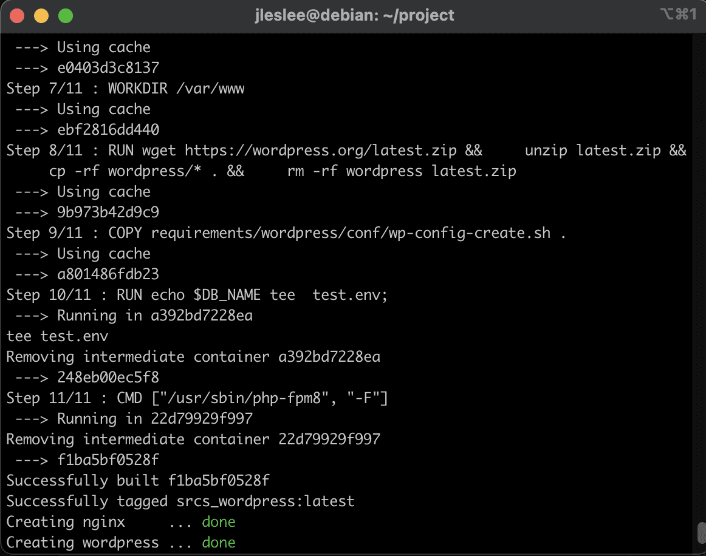

# Link all services together - Volumes and Network

At this point we have each service working correctly by itself, but not quite finished yet, as some of them need to be connected to other. So, to finish the work, let's modify our docker-compose.yml to set this connections right. Also, we could upgrade our Makefile again after all the work is done, adding some useful rules.

## Step 6. Update nginx configuration to work with WordPress

We need to change the configuration of nginx so that it processes only php files. To do this, remove everything from the config index.html .

``vim requirements/nginx/conf/nginx.conf``

For complete happiness, we just need to uncomment the nginx block that processes php so that our nginx.conf looks like this:

```
server {
    listen      443 ssl;
    server_name  <your_nickname>.42.fr www.<your_nickname>.42.fr;
    root    /var/www/;
    index index.php;
    ssl_certificate     /etc/nginx/ssl/<your_nickname>.42.fr.crt;
    ssl_certificate_key /etc/nginx/ssl/<your_nickname>.42.fr.key;
    ssl_protocols       TLSv1.2 TLSv1.3;
    ssl_session_timeout 10m;
    keepalive_timeout 70;
    location / {
        try_files $uri /index.php?$args;
        add_header Last-Modified $date_gmt;
        add_header Cache-Control 'no-store, no-cache';
        if_modified_since off;
        expires off;
        etag off;
    }
    location ~ \.php$ {
        fastcgi_split_path_info ^(.+\.php)(/.+)$;
        fastcgi_pass wordpress:9000;
        fastcgi_index index.php;
        include fastcgi_params;
        fastcgi_param SCRIPT_FILENAME $document_root$fastcgi_script_name;
        fastcgi_param PATH_INFO $fastcgi_path_info;
    }
}
```

We will definitely replace all <your_nickname> with an inter nickname to make it work.

Now our configuration is ready to launch.

## Step 2. Create volumes and Network

nginx and wordpress should have a common section for data exchange. Also, the task requires a section for storing the database. And all this should be stored in our /home/<username>/data. You can mount the same folder back and forth, but for convenience, create a partition by specifying the path to its folder:v

```
volumes:
  wp-volume:
    driver_opts:
      o: bind
      type: none
      device: /home/${USER}/data/wordpress

  db-volume:
    driver_opts:
      o: bind
      type: none
      device: /home/${USER}/data/mariadb
```

Next, we need to combine our containers into a single network. In fact, all containers that are registered inside a single docker-compose file or whose configurations are located in the same folder are automatically combined into a common network. However, the name of the network is not set by us. But accessing the web can sometimes be useful.

In order for our network to be accessible to us by name, let's create our own network in addition to the default one. It is created extremely simply:
```
networks:
    inception:
        driver: bridge
```

Now let's add this section and our network to all the containers that depend on it. And let's not forget to uncomment nginx dependencies. So our entire configuration will look like this:

```
version: '3'

services:
  nginx:
    build:
      context: .
      dockerfile: requirements/nginx/Dockerfile
    container_name: nginx
    depends_on:
      - wordpress
    ports:
      - "443:443"
    networks:
      - inception
    volumes:
      - ./requirements/nginx/conf/:/etc/nginx/http.d/
      - ./requirements/nginx/tools:/etc/nginx/ssl/
      - wp-volume:/var/www/
    restart: always

  mariadb:
    build:
      context: .
      dockerfile: requirements/mariadb/Dockerfile
      args:
        DB_NAME: ${DB_NAME}
        DB_USER: ${DB_USER}
        DB_PASS: ${DB_PASS}
        DB_ROOT: ${DB_ROOT}
    container_name: mariadb
    ports:
      - "3306:3306"
    networks:
      - inception
    volumes:
      - db-volume:/var/lib/mysql
    restart: always

  wordpress:
    build:
      context: .
      dockerfile: requirements/wordpress/Dockerfile
      args:
        DB_NAME: ${DB_NAME}
        DB_USER: ${DB_USER}
        DB_PASS: ${DB_PASS}
    container_name: wordpress
    depends_on:
      - mariadb
    restart: always
    networks:
      - inception
    volumes:
      - wp-volume:/var/www/

volumes:
  wp-volume:
    driver_opts:
      o: bind
      type: none
      device: /home/${USER}/data/wordpress

  db-volume:
    driver_opts:
      o: bind
      type: none
      device: /home/${USER}/data/mariadb

networks:
    inception:
        driver: bridge
```

# Step 3. Checking the configuration operation

So, after we run `docker-compose u --build` in our `~/project/srcs" directory, we will observe the configuration build for a while. And finally, we will find that everything is assembled and working.:



Just in case, we will check the functionality of the configuration. Let's run a few commands. First, listen to the php socket:

``docker exec -it wordpress ps aux | grep 'php'``

The output should be as follows:

```
    1 root      0:00 {php-fpm8} php-fpm: master process (/etc/php8/php-fpm.conf
    9 nobody    0:00 {php-fpm8} php-fpm: pool www
   10 nobody    0:00 {php-fpm8} php-fpm: pool www
```

Then let's see how php works, having found out the version:

``docker exec -it wordpress php -v``

```
PHP 8.0.22 (cli) (built: Aug  5 2022 23:54:32) ( NTS )
Copyright (c) The PHP Group
Zend Engine v4.0.22, Copyright (c) Zend Technologies
```

Finally, let's check if all the modules are installed.:

``docker exec -it wordpress php -m``

```
[PHP Modules]
Core
curl
date
dom
exif
fileinfo
filter
hash
json
libxml
mbstring
mysqli
mysqlnd
openssl
pcre
readline
Reflection
SPL
standard
xml
zip
zlib

[Zend Modules]
```

... and voila! - the settings panel opens in front of us:


## Step 9. Changing the Makefile

Also, do not forget to copy our Makefile. It will have to be changed a bit, because docker-compose is on the srcs path. This imposes certain restrictions on us, because by making a make on the directory above, we will not pick up our secrets (the system will search.env in the same directory where the Makefile is located). Therefore, we indicate to our docker-compose not only the path to ./srcs, but also the path to .env. This is done by specifying the --env-file flag.:

```
name = inception
all:
	@printf "Launch configuration ${name}...\n"
  @bash srcs/requirements/wordpress/tools/make_dir.sh
	@docker-compose -f ./srcs/docker-compose.yml --env-file srcs/.env up -d

build:
	@printf "Building configuration ${name}...\n"
  @bash srcs/requirements/wordpress/tools/make_dir.sh
	@docker-compose -f ./srcs/docker-compose.yml --env-file srcs/.env up -d --build

down:
	@printf "Stopping configuration ${name}...\n"
	@docker-compose -f ./srcs/docker-compose.yml --env-file srcs/.env down

re: down
	@printf "Rebuild configuration ${name}...\n"
	@docker-compose -f ./srcs/docker-compose.yml --env-file srcs/.env up -d --build

clean: down
	@printf "Cleaning configuration ${name}...\n"
	@docker system prune -a
	@sudo rm -rf ~/data/wordpress/*
	@sudo rm -rf ~/data/mariadb/*

fclean:
	@printf "Total clean of all configurations docker\n"
	@docker stop $$(docker ps -qa)
	@docker system prune --all --force --volumes
	@docker network prune --force
	@docker volume prune --force
	@sudo rm -rf ~/data/wordpress/*
	@sudo rm -rf ~/data/mariadb/*

.PHONY	: all build down re clean fclean
```

I advise you to do a make clean before saving it to the cloud.

***

The project is deployed `make build", the stop is `make down", the start after the stop is `make`, etc`

This completes the main part of the project. After configuring wordpress, the project can be submitted. You also need to save all the sources to the repository and be able to correctly deploy your project from them.
