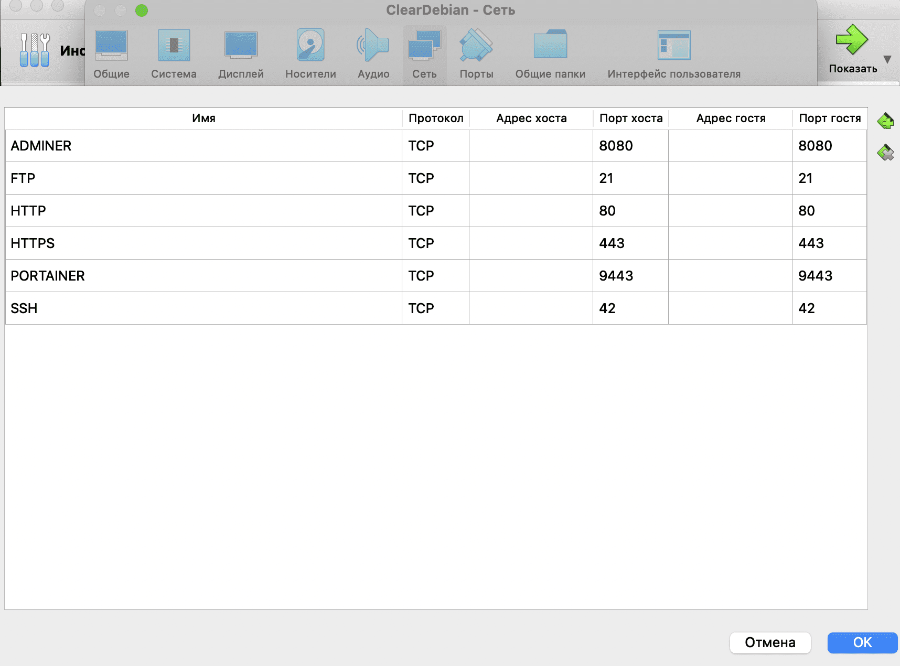
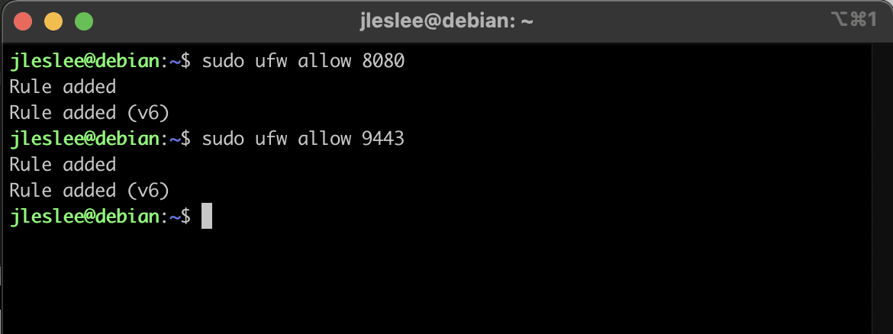

# vsftpd file server

So, guys, as we remember from pipex, files, along with processes, are basic linux abstractions.


In the inception project, this knowledge will not be useful to us!

Let's be happy that we don't have to dive into low-level programming! After all, all we need now is just to write a container containing a file server for working with the wordpress section. Not these I/O streams of yours...

We will install a vsftpd server in the container - a Very Saveful File TransPort Daemon, or in Bourgeois, a very secure file transport daemon. By the name, it seems that it should look like this:


However, in reality it looks like this:


The poor guy doesn't even have his own logo, so they usually photoshop him against the background of the Tux Linux penguin.

## Step 1. Create a Dockerfile

As usual, we start with the Dockerfile.:

``vim requirements/bonus/vsftpd/Dockerfile``

In it, we will get the username and password for our ftp server user in variables via ARG. Then we will install our vsftpd. We need to create a user to connect to the server, and we will do this in the next layer. We will install /var/www as the home section for it, where we will mount the section with our wp. Let's not forget to add this user to the root group so that we can process the wordpress directory (otherwise we simply won't have enough rights).

After that, we will set up the configuration file correctly - we will uncomment the parameters we need and add the missing ones. We'll make /var/www the root folder, open port 21 and launch our daemon by feeding it the newly configured vsftpd.conf file.:

```
FROM alpine:3.16

ARG FTP_USR \
    FTP_PWD

RUN apk update && apk upgrade && \
    apk add --no-cache vsftpd

RUN adduser -h /var/www -s /bin/false -D ${FTP_USR} && \
    echo "${FTP_USR}:${FTP_PWD}" | /usr/sbin/chpasswd && \
    adduser ${FTP_USR} root

RUN sed -i "s|#chroot_local_user=YES|chroot_local_user=YES|g"  /etc/vsftpd/vsftpd.conf && \
    sed -i "s|#local_enable=YES|local_enable=YES|g"  /etc/vsftpd/vsftpd.conf && \
    sed -i "s|#write_enable=YES|write_enable=YES|g"  /etc/vsftpd/vsftpd.conf && \
    sed -i "s|#local_umask=022|local_umask=007|g"  /etc/vsftpd/vsftpd.conf

RUN echo "allow_writeable_chroot=YES" >> /etc/vsftpd/vsftpd.conf &&\
    echo 'seccomp_sandbox=NO' >> /etc/vsftpd/vsftpd.conf && \
    echo 'pasv_enable=YES' >> /etc/vsftpd/vsftpd.conf

WORKDIR /var/www

EXPOSE 21

CMD [ "/usr/sbin/vsftpd", "/etc/vsftpd/vsftpd.conf" ]
```

## Step 2. Putting the secrets in .env

Opening the .env file:

``vim .env``

We add the username and password lines there. So the whole file will look like this:

```
DOMAIN_NAME=jleslee.42.fr
CERT_=./requirements/tools/jleslee.42.fr
KEY_=./requirements/tools/jleslee.42.fr
DB_NAME=wordpress
DB_ROOT=rootpass
DB_USER=wpuser
DB_PASS=wppass
FTP_USR=ftpuser
FTP_PWD=ftppass
```

Login and password can be any.

## Step 3. Add the section to docker-compose

In order for the variables from .env to be passed to the Dockerfile, you need to register them in docker-compose as well. The section of our daemon will look like this:

```
  vsftpd:
    build:
      context: .
      dockerfile: requirements/bonus/vsftpd/Dockerfile
      args:
        FTP_USR: ${FTP_USR}
        FTP_PWD: ${FTP_PWD}
    container_name: vsftpd
    ports:
      - "21:21"
    volumes:
      - wp-volume:/var/www/
    networks:
     - inception
    restart: always
```

This completes the configuration stage, and we proceed to verification.

## Step 4. Checking the vsftpd operation

We need an ftp client for verification. If we want to connect to the container from the outside, we will also have to forward the port with our school's number (*as an advertisement) to the outside:



However, we are "poor students" of school-21 and our macs don't even have a set of essential software like postman or filezilla. At least, not all computers have them. Therefore, we will not have to work on the mac with this port externally, for verification we will install an ftp client inside the virtual machine. It makes sense to forward port 21 on a home PC./A laptop where you can install filezilla.

But port 9443 and 8080 will be useful to us in the following guides for such cool things as portainer and adminer. 

Portainer is a functional dashboard that provides a convenient graphical environment for managing containers. Adminer is a lightweight graphical environment for database administration.

Since we have entered port forwarding, we need to open these ports for the future! And don't forget to open the ports in the firewall.:



Since I will be running filezilla inside a virtual machine, I will not open port 21 externally.

Now go back to the terminal and install the filezilla ftp client in the virtual machine.:

``sudo apt install -y filezilla``

While our filezilla is being installed, go to the virtualbox window with our running system. We log in there and run the graphics:

``sudo startx``

In openbox, our ftp client will be available in the internet tab after installation.:


We launch and log in to it using the local host (127.0.0.1), entering the username and password specified in the .env file, selecting the same port 21.:


Hooray, we've entered our wp-volume ssh section! We can poke around there, create folders and files, delete something we don't really need, break the project and rebuild it again - docker-compose provides us with this wonderful opportunity!

So, thank the demons, we have FTP access configured. Let's move on to configuring the DBMS database management system. About her - in the next guide.